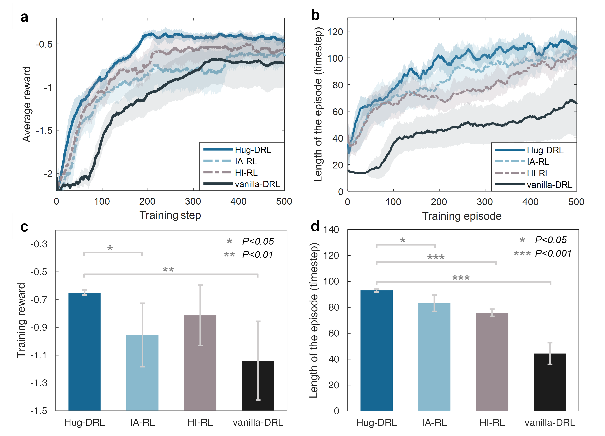

# Human-in-the-Loop Deep Reinforcement Learning for Autonomous Driving in Complex Urban Scenarios

> **A TD3HUG-based framework where real-time human intervention directly shapes agent learning in the CARLA simulator.**

---

## Overview

This repository implements a **Human-in-the-Loop (HITL) Deep Reinforcement Learning** pipeline for autonomous vehicle control. A human operator can intervene at any timestep during training — overriding the agent's steering action via mouse or keyboard — and those interventions are stored as privileged demonstrations that accelerate and guide the learning process.

The environment is built on **CARLA 0.9.15** and presents the ego vehicle with five concurrent hazard types in a single episode, requiring the agent to learn nuanced avoidance strategies that pure RL often struggles to discover from scratch.

The implementation uses **TD3HUG** (Human-Guided TD3) — intervention transitions receive upweighted gradient updates during policy learning.

---

## Key Contributions

- **Real-time human override loop**: holding the right mouse button activates human control (or arrow keys for keyboard control); releasing it returns control to the AI. Intervention transitions are flagged (`intervention=1`) and handled separately in the replay buffer.
- **Multi-hazard CARLA environment**: five simultaneous obstacle types — wrong-way parked car, oncoming vehicle, jaywalking pedestrian, crosswalk pedestrian, and sidewalk walker.
- **TD3HUG algorithm**: a TD3 backbone (twin critics, delayed actor updates, target policy smoothing) where human intervention transitions receive upweighted gradient updates during learning.
- **Reward shaping**: configurable strategies including no shaping, intervention-penalty, potential-based, and RND (Random Network Distillation) intrinsic reward.

---

## System Architecture

```
┌─────────────────────────────────────────────────────────────┐
│                     Training Loop                           │
│                                                             │
│   ┌──────────┐    action_ai     ┌─────────────────────┐    │
│   │  TD3HUG  │ ───────────────► │   CARLA Environment  │    │
│   │  Agent   │                  │  (5 hazard types)    │    │
│   └──────────┘                  └──────────┬──────────┘    │
│        ▲                                   │               │
│        │  learn()               state, reward, done        │
│        │                                   │               │
│   ┌────┴─────────────────────────────────┐ │               │
│   │         Replay Buffer                │◄┘               │
│   │  • AI transitions  (intervention=0)  │                 │
│   │  • Human transitions (intervention=1)│                 │
│   │    (upweighted during learning)      │                 │
│   └──────────────────────────────────────┘                 │
│                        ▲                                    │
│              Human holds RMB / arrow keys → takes over      │
│              Releases control → AI resumes control          │
└─────────────────────────────────────────────────────────────┘
```

---

## Environment: Multi-Obstacle CARLA Scenario

The ego vehicle (Tesla blueprint) spawns at a fixed start point and must navigate 70 metres of road to a goal zone. Five obstacles are spawned simultaneously each episode:

| # | Obstacle Type | Behavior |
|---|--------------|----------|
| 1 | Wrong-way parked car | Static, occupying ego lane |
| 2 | Oncoming vehicle | Moving toward ego at −3 m/s |
| 3 | Jaywalking pedestrian | Crossing road at 1.2 m/s |
| 4 | Crosswalk pedestrian | Crossing at 0.8 m/s at a marked crossing |
| 5 | Sidewalk walker | Walking parallel to road at 0.5 m/s |

**State space** (12-dimensional): ego (x, y) + relative (Δx, Δy) to each of the 5 obstacles.

**Action space** (1-dimensional continuous): steering in [−1, 1]. Throttle is held fixed at 0.35.

**Reward function**:
```
r = 0.2                              # time-step survival bonus
  - 1.5 × |x_ego − x_lane_center|   # lane-keeping penalty
  - Σ proximity_penalty(obstacle_i)  # proximity to each obstacle
  + 10  (on reaching goal)           # terminal success bonus
  − 10  (on collision)               # terminal failure penalty
```

---

## Algorithm: TD3HUG

**TD3HUG (Human-Guided TD3)** — a TD3 backbone (twin critics, delayed actor updates, target policy smoothing) where transitions collected during human intervention receive upweighted gradient updates when the policy is trained. The intuition: human takeovers happen at states the agent handled poorly, so those transitions carry more learning signal than ordinary agent-generated transitions.

**Note:** This repository implements and tests TD3HUG only. Other human-guided TD3 variants (e.g., intervention-aware critic shaping, disagreement-based gradient scaling) were explored conceptually but are **not implemented in this codebase** — the code here reflects TD3HUG exclusively.

---

## Reward Shaping Strategies

| Flag | Strategy | Description |
|------|----------|-------------|
| `0` | None | Extrinsic reward only |
| `1` | Intervention penalty | −10 intrinsic reward at first intervention step per episode |
| `2` | Potential-based | Intrinsic reward proportional to remaining distance to goal |
| `3` | RND | Novelty-based intrinsic reward via Random Network Distillation; encourages exploration of unseen states |

*(Verify which of these you actually ran and report results for — if you only tested one or two, note that here explicitly.)*

---

## Controls (During Training)

| Input | Action |
|-------|--------|
| Hold **Right Mouse Button** | Activate human takeover (mouse) |
| Move mouse left / right | Analog steering |
| **A** / **←** | Steer left |
| **D** / **→** | Steer right |
| **S** / **↓** | Centre steering / brake |
| **W** / **↑** | Throttle |
| Release control | Return control to AI agent |

Both mouse-based and keyboard-based (arrow key) human control were used across different training runs.

---

## Repository Structure

```
Human_In_Loop/
├── README.md
├── requirements.txt
├── env.py                                  # Pygame + CARLA env wrapper (mouse/keyboard HITL)
├── utils.py                                # Seed, signal handler, path generator, RND module
├── train_offline_latest.py                 # Main training script
├── train_offline.py                        # Earlier training script (kept for reference)
├── carla_hitl_multi_obstacle_environment.py # Multi-obstacle CARLA scene definition
├── TD3_based_DRL/                          # TD3HUG implementation
│   ├── TD3HUG.py
│   └── checkpoints/
├── episode_data/                           # Saved episode trajectories (.mat)
└── results.png                             # Training reward curves
```

*(Only TD3HUG.py exists in this repo. If wheel_config.ini is not actually used, remove it from the repo and this structure list.)*

---

## Setup

### Requirements

- Ubuntu 20.04 / 22.04
- Python 3.8+
- CARLA 0.9.15 ([download](https://github.com/carla-simulator/carla/releases/tag/0.9.15))
- CUDA-capable GPU (recommended)

### Install dependencies

```bash
pip install -r requirements.txt
```

### Launch CARLA server

```bash
./CarlaUE4.sh -RenderOffScreen   # headless
# or
./CarlaUE4.sh                    # with rendering
```

### Run training

```bash
# TD3HUG with default reward
python train_offline_latest.py

# TD3HUG with RND reward shaping
python train_offline_latest.py --reward_shaping 3

# Resume from checkpoint
python train_offline_latest.py --resume
```

### Key arguments

| Argument | Default | Description |
|----------|---------|-------------|
| `--reward_shaping` | `0` | 0=none, 1=intervention, 2=potential, 3=RND |
| `--maximum_episode` | `1000` | Total training episodes |
| `--warmup` | `False` | Collect random transitions before learning |
| `--device` | `cuda` | Training device |

*(Adjust these to match your actual argparse flags — verify against `train_offline_latest.py`.)*

### Monitor training

```bash
tensorboard --logdir TD3_based_DRL/checkpoints/log
```

---

## Results



Episode rewards, intervention frequency, and loss curves are logged to TensorBoard and saved as `.mat` files for offline analysis in MATLAB/Python.

---

## Design Decisions

**Why TD3 over SAC or PPO?**
TD3's deterministic policy makes it straightforward to blend human and agent actions at inference time — there is no stochastic sampling step to reconcile.

**Why upweight human intervention transitions (TD3HUG)?**
Human takeovers happen at states where the agent was performing poorly or facing a novel hazard configuration. Treating these transitions as ordinary experience under-uses the most informative signal in the dataset; upweighting them during gradient updates biases learning toward the states that matter most for safety.

**Why RND for intrinsic reward?**
CARLA environments are large and sparsely rewarded. RND gives the agent an intrinsic signal to explore novel states rather than converging on a single safe trajectory, which matters when five obstacle configurations vary each episode.

---

## Attribution

This implementation builds on an open-source CARLA-based Human-in-the-Loop RL reference (exact source repository not retained — being tracked down). The TD3HUG implementation, multi-hazard environment configuration, and training loop reflect my own implementation and experimentation on top of that base.

---

## License

This project is licensed under the **GNU General Public License v3.0**. See [LICENSE](LICENSE) for details.
